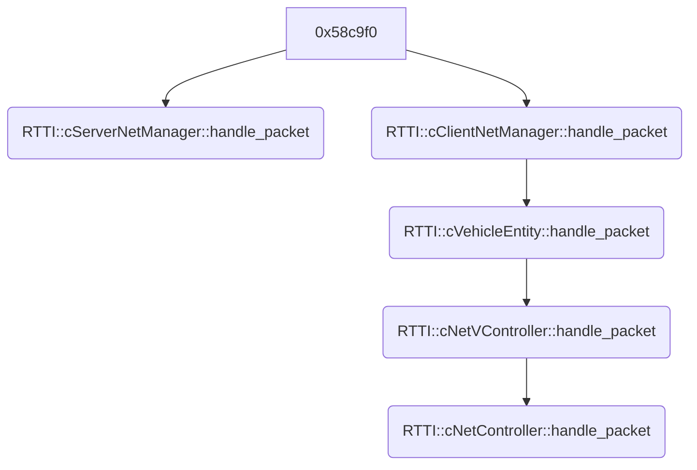

# Protocol notes

Raw UDP Payload:

```
0f0000020007007544b3c59018374774c6b246009805000009955f3c00067134
0281062c090900001d007f5e0e22c6ddf52247cce2b64655163b8c8e0b4a272f
44e7afc745ef91354600000000000000000008155f8300035186005100e9fb08
050040007e5700ffff6301000010ff2365f96e1e00000002000000105f000006
21e000daf7b1f73a0000c800ff7544b3c59018374774c6b24697f5d702000000
00000000000000000000000000000000002c2502159ba419d1c4012d3c47252d
af465359899e7745e6531142b96009c4ffff2402159e7f005800b5ff20f1f019
04210bd5f5ffff2302159f4a6cd1c44625314792e5b04614cb45d6da5c26aa4e
44a2ca72c5cdb4edc3ffff2202159e7e0014009efff6e8c89f0822fc8ff3ffff
```

Hexdump:

```
0000  0F 00 00 02 00 07 00 75 44 B3 C5 90 18 37 47 74  .......uD....7Gt
0010  C6 B2 46 00 98 05 00 00 09 95 5F 3C 00 06 71 34  ..F......._<..q4
0020  02 81 06 2C 09 09 00 00 1D 00 7F 5E 0E 22 C6 DD  ...,.......^."..
0030  F5 22 47 CC E2 B6 46 55 16 3B 8C 8E 0B 4A 27 2F  ."G...FU.;...J'/
0040  44 E7 AF C7 45 EF 91 35 46 00 00 00 00 00 00 00  D...E..5F.......
0050  00 00 08 15 5F 83 00 03 51 86 00 51 00 E9 FB 08  ...._...Q..Q....
0060  05 00 40 00 7E 57 00 FF FF 63 01 00 00 10 FF 23  ..@.~W...c.....#
0070  65 F9 6E 1E 00 00 00 02 00 00 00 10 5F 00 00 06  e.n........._...
0080  21 E0 00 DA F7 B1 F7 3A 00 00 C8 00 FF 75 44 B3  !......:.....uD.
0090  C5 90 18 37 47 74 C6 B2 46 97 F5 D7 02 00 00 00  ...7Gt..F.......
00a0  00 00 00 00 00 00 00 00 00 00 00 00 00 00 00 00  ................
00b0  00 2C 25 02 15 9B A4 19 D1 C4 01 2D 3C 47 25 2D  .,%........-<G%-
00c0  AF 46 53 59 89 9E 77 45 E6 53 11 42 B9 60 09 C4  .FSY..wE.S.B.`..
00d0  FF FF 24 02 15 9E 7F 00 58 00 B5 FF 20 F1 F0 19  ..$.....X... ...
00e0  04 21 0B D5 F5 FF FF 23 02 15 9F 4A 6C D1 C4 46  .!.....#...Jl..F
00f0  25 31 47 92 E5 B0 46 14 CB 45 D6 DA 5C 26 AA 4E  %1G...F..E..\&.N
0100  44 A2 CA 72 C5 CD B4 ED C3 FF FF 22 02 15 9E 7E  D..r......."...~
0110  00 14 00 9E FF F6 E8 C8 9F 08 22 FC 8F F3 FF FF  ..........".....
```

Split up into parts:

```
0f00 0002 0007 00 7544b3c5 90183747 74c6b246 0098

0500 00 09955f3c000671340281062c090900001d007f5e0e22c6ddf52247cce2b64655163b8c8e0b4a272f44e7afc745ef913546000000000000
0000 00 08155f8300035186005100e9fb08050040007e5700ffff6301000010ff2365f96e1e000000
0200 00 00105f00000621e000daf7b1f73a0000c800ff7544b3c59018374774c6b24697f5d70200000000000000000000000000000000000000002c
2502 15 9ba419d1c4012d3c47252daf465359899e7745e6531142b96009c4ffff
2402 15 9e7f005800b5ff20f1f01904210bd5f5ffff
2302 15 9f4a6cd1c44625314792e5b04614cb45d6da5c26aa4e44a2ca72c5cdb4edc3ffff
2202 15 9e7e0014009efff6e8c89f0822fc8ff3ffff
```

Log message:

```
Size: 0285   PlyId: 002   NumVals: 007
  ( 0:'net  5'-00) 09955f3c000671340281062c090900001d007f5e0e22c6ddf52247cce2b64655163b8c8e0b4a272f44e7afc745ef913546000000000000
  ( 1:'net  0'-00) 08155f8300035186005100e9fb08050040007e5700ffff6301000010ff2365f96e1e000000
  ( 2:'net  2'-00) 00105f00000621e000daf7b1f73a0000c800ff7544b3c59018374774c6b24697f5d70200000000000000000000000000000000000000002c
  ( 3:'net549'-15) 9ba419d1c4012d3c47252daf465359899e7745e6531142b96009c4ffff
  ( 4:'net548'-15) 9e7f005800b5ff20f1f01904210bd5f5ffff
  ( 5:'net547'-15) 9f4a6cd1c44625314792e5b04614cb45d6da5c26aa4e44a2ca72c5cdb4edc3ffff
  ( 6:'net546'-15) 9e7e0014009efff6e8c89f0822fc8ff3ffff
```

Structure:

```
0f # Flags
00 # Usr Str Len
XX # Usr Str
0002 # PlayerID
0007 # Num Vals
00 # UsrString Len?
7544b3c5 # Pos.X
90183747 # Pos.Y
74c6b246 # Pos.Z
00 # Player Index
98 # Rtt
# Ent_ID, Ent_Type, Data
0500 00 09955f3c000671340281062c090900001d007f5e0e22c6ddf52247cce2b64655163b8c8e0b4a272f44e7afc745ef913546000000000000
0000 00 08155f8300035186005100e9fb08050040007e5700ffff6301000010ff2365f96e1e000000
0200 00 00105f00000621e000daf7b1f73a0000c800ff7544b3c59018374774c6b24697f5d70200000000000000000000000000000000000000002c
2502 15 9ba419d1c4012d3c47252daf465359899e7745e6531142b96009c4ffff
2402 15 9e7f005800b5ff20f1f01904210bd5f5ffff
2302 15 9f4a6cd1c44625314792e5b04614cb45d6da5c26aa4e44a2ca72c5cdb4edc3ffff
2202 15 9e7e0014009efff6e8c89f0822fc8ff3ffff
```

suspected flags (`0x58c9f0`):

```
(Mode == MASTER) && (Flags >> 7 == PKT_DIR) || (Mode == CLIENT) && (Flags >> 7 != PKT_DIR)
```

- 7: Pkt direction

```python
from collections import Counter
import binascii
packets = []
c=Counter()
for line in open(r"D:\devel\Git_Repos\Scrapland-RE\tools\remaster\scrap_net\test_.log"):
	addr, data = line.split()
	data = binascii.unhexlify(data)
	for i,b in enumerate("{:08b}".format(data[0])[::-1]):
		c[(addr,i,b)]+=1
	print(addr,"{:08b}".format(data[0]))
```
Bit frequencies:
```
('<127.0.0.1:28086', 0, '0') 227  
('<127.0.0.1:28086', 0, '1') 767  
('>127.0.0.1:52472', 0, '0') 774  
('>127.0.0.1:52472', 0, '1') 228  
('<127.0.0.1:28086', 1, '0') 218  
('<127.0.0.1:28086', 1, '1') 776  
('>127.0.0.1:52472', 1, '0') 135  
('>127.0.0.1:52472', 1, '1') 867  
('<127.0.0.1:28086', 2, '0') 189  
('<127.0.0.1:28086', 2, '1') 805  
('>127.0.0.1:52472', 2, '0') 966  
('>127.0.0.1:52472', 2, '1') 36  
('<127.0.0.1:28086', 3, '0') 815  
('<127.0.0.1:28086', 3, '1') 179  
('>127.0.0.1:52472', 3, '0') 8  
('>127.0.0.1:52472', 3, '1') 994  
('<127.0.0.1:28086', 4, '0') 994  
('>127.0.0.1:52472', 4, '0') 1001  
('>127.0.0.1:52472', 4, '1') 1  
('<127.0.0.1:28086', 5, '0') 994  
('>127.0.0.1:52472', 5, '0') 1001  
('>127.0.0.1:52472', 5, '1') 1  
('<127.0.0.1:28086', 6, '0') 994  
('>127.0.0.1:52472', 6, '0') 1001  
('>127.0.0.1:52472', 6, '1') 1  
('<127.0.0.1:28086', 7, '0') 494  
('<127.0.0.1:28086', 7, '1') 500  
('>127.0.0.1:52472', 7, '0') 496  
('>127.0.0.1:52472', 7, '1') 506
```

```c
#pragma endian big

struct NetValue {
    le u16 entity_index;
    u8 entity_type;
    char data[?]; // variable length
};

struct NetData {
    u8 flags;
    u8 usr_str_len;
    char usr_str[usr_str_len];
    u16 player_id;
    u16 num_vals;
    u8 unk_2;
    le float pos[3];
    u8 player_idx;
    u8 rtt_ms;
    NetValue values[num_vals];
};

```

Packets are split into command packets (map change, resources, chat message, etc) and entity updates

## Entity Types
- 00: Vehicle
- 01: Cloud
- 02: Swarm
- 03: Inferno
- 04: Sonic
- 05: EMI
- 06: Box:Ener
- 07: Box:Miss
- 08: Box:Part
- 09: Box:Life
- 10: Box:iXtr
- 11: Box:iSiz
- 12: Box:aBom
- 13: Box:aSpd
- 14: Box:dAim
- 15: Box:dBom
- 16: Box:tAim
- 17: Box:tTra
- 18: Box:sRot
- 19: Box:sRck
- 20: Box:vAim
- 21: Box:vSpd

## Control Flow




## Client->Server (handled in `cClientNetManager`) Packet Types

- 00: Player Join
	- u16: NET_GAME_ID (`0xbace`)
	- u16: NET_GAME_VERSION (`0x101`)
	- str: ServerPassword
	- str: PlayerName
	- str: ShipModelName
	- u16: ShipHealth
	- str: PilotModel
	- str\[4]: EngineModels
	- str: Loadout
	- u32: TeamNumber
- 06: Player Modify
	- Same as 00: Player Join
- 02: Disconnect
- 03: Chat String
	- str: ChatString
- 04: Usr String
	- str: UsrString
- 05: Unk (Keepalive?)
- 08: Remote command
	- str: ServerRemotePassword
	- str: Command

## Server->Client (handled in `cServerNetManager`) Packet types

- 00: Map Change:
  - str map_name
  - str game_mode

- 01: Resource:
  - u16: resource_index
  - u16: unk
  - str[]: resource_name 

- 02: Unknown (Keepalive?)

- 03: ChatMessage
  - str: ChatStr

- 04: UsrString:
  - str: UsrStr

- 05: Player join:
  - u8: player_id
  - str: player_name
  - str: ship_model
  - u16: max_health
  - str\[4]: engine_models
  - str: pilot_model
  - str: loadout
  - u32: team_number

- 06: unknown
  - u8: ent_index

- 07: unknown (restart?)

## General (handled in `cNetController`)  Packet

Constants:
- 40.42535 => 127/$\pi$
- 10185.92 => 3200/$\pi$
- 0.1047198 => $\pi$/30
- 6.702065 => (32$\pi$)/15

Flags:
- is_abs (0x1)
- has_pos (0x2)
- has_ang_1 (0x4)
- has_ang_2 (0x8)
- has_ang_xyz (0x10)
- has_unk (0x20)

```python
if has_pos:
    if is_abs: Pos = [u32;3]
    else: Pos += [u16;3]*32.0
  
if has_ang_1:
    if is_abs: Ang_1 = [u16;2] / 10185.92
    else: Ang_1 = [u8;2] / 40.42535

if has_ang_2:
    if is_abs: Ang_2 += [u16;1] / 10185.92
    else: Ang_2 = [u8;1] / 40.42535

if has_ang_xyz:
    if is_abs: Ang_XYZ = [u32;3]
    else: Ang_XYZ = [u16;3]

if has_unk:
    if is_abs: Unk = [u16;3]*6.702065
    else: Unk = [u8;3]*0.1047198

```

## Vehicle (handled in `cNetVController`)  Packet

TODO

```
flags: u16
	
	

```