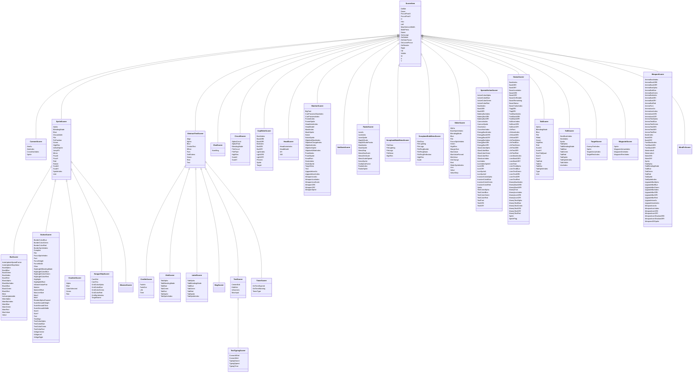

# Inheritance

(Shoutout to Strongleong for providing a script the grab this data from Ghidra!)

```mermaid
classDiagram
    ScorerItem <|-- CannonScorer
    ScorerItem <|-- SpriteScorer
    ScorerItem <|-- AbstractTextScorer
    SpriteScorer <|-- BarScorer
    SpriteScorer <|-- ButtonScorer
    ScorerItem <|-- ChatScorer
    ScorerItem <|-- CircuitScorer
    ScorerItem <|-- CopMeterScorer
    AbstractTextScorer <|-- CreditsScorer
    SpriteScorer <|-- GradientScorer
    SpriteScorer <|-- HangarShipScorer
    ScorerItem <|-- HeadScorer
    AbstractTextScorer <|-- HintScorer
    AbstractTextScorer <|-- LabelScorer
    SpriteScorer <|-- MissionScorer
    ScorerItem <|-- MonitorScorer
    AbstractTextScorer <|-- MsgScorer
    ScorerItem <|-- NetStatsScorer
    ScorerItem <|-- RadarScorer
    ScorerItem <|-- ScraplandMainMenuScorer
    ScorerItem <|-- ScraplandSubMenuScorer
    ScorerItem <|-- SliderScorer
    ScorerItem <|-- SpecialActionScorer
    ScorerItem <|-- StatusScorer
    ScorerItem <|-- TabScorer
    ScorerItem <|-- TalkScorer
    ScorerItem <|-- TargetScorer
    AbstractTextScorer <|-- TextScorer
    TextScorer <|-- TextTypingScorer
    AbstractTextScorer <|-- TimerScorer
    ScorerItem <|-- WaypointScorer
    ScorerItem <|-- WeaponScorer
    ScorerItem <|-- WindFxScorer
    class AbstractTextScorer {
       Align
       Alpha
       Blue
       CentralText
       Effect
       Font
       GetExtens
       Green
       Red
       Text
    }
    class BarScorer {
       AutoUpdateSpeedFactor
       AutoUpdateStopValue
       BackAlpha
       BackBlue
       BackGreen
       BackIndex
       BackRed
       BlackAlpha
       BlackBarIndex
       BlackBlue
       BlackGreen
       BlackRed
       Blink
       IsAutoUpdatable
       MainAlpha
       MainBarIndex
       MainBlue
       MainGreen
       MainRed
       MaxValue
       Value
    }
    class ButtonScorer {
       BorderColorBlue
       BorderColorGreen
       BorderColorRed
       BorderSpriteIndex
       Complex
       File
       FocusSpriteIndex
       Font
       ForceHeight
       ForceWidth
       Glow
       HighLightBlendingMode
       HighLightColorBlue
       HighLightColorGreen
       HighLightColorRed
       Highlight
       HighlightOffset
       IsNameValuePair
       Marker
       MarkerOffset
       MaxLineSize
       MaxX
       MinX
       RenderAlphaChannel
       ScaleSmoothHeight
       ScaleSmoothTime
       ScaleSmoothWidth
       SizeX
       SizeY
       Text
       TextAlign
       TextColorAlpha
       TextColorBlue
       TextColorGreen
       TextColorRed
       XAlignCenter
       XAlignLeft
       XAlignRight
    }
    class CannonScorer {
       AimAc
       AimIndex
       CrossHairIndex
       Sprite
    }
    class ChatScorer {
       NumMsg
    }
    class CircuitScorer {
       AlphaCircuit
       AlphaFlare
       BlendingMode
       FileCircuit
       FileFlare
       HighRes
       ScaleX
       ScaleY
    }
    class CopMeterScorer {
       BackIndex
       BackOffX
       BackOffY
       BarIndex
       BarOffX
       BarOffY
       LightIndex
       LightOffX
       LightOffY
       Percent
       Sprite
       Target
    }
    class CreditsScorer {
       FadeIn
       FadeOut
       Life
       Time
    }
    class GradientScorer {
       Alpha
       Blue
       ColorSelected
       Green
       Red
    }
    class HangarShipScorer {
       CamDist
       CamFov
       GridColorAlpha
       GridColorBlue
       GridColorGreen
       GridColorRed
       GridSpriteIndex
       TargetName
    }
    class HeadScorer {
       HeadAnimIndex
       HeadModel
       VH
       VW
    }
    class HintScorer {
       TabAlpha
       TabBlendingMode
       TabBlue
       TabGreen
       TabRed
       TabSprite
       TabSpriteIndex
    }
    class LabelScorer {
       TabAlpha
       TabBlendingMode
       TabBlue
       TabGreen
       TabRed
       TabSprite
       TabSpriteIndex
    }
    class MissionScorer {
    }
    class MonitorScorer {
       BigFont
       CanPossessGlowIndex
       CanPossessIndex
       FrameIndex
       FrameSprite
       HeadAnimIndex
       HeadModel
       MaskIndex
       MaskSprite
       Noise
       NoiseSprite
       ObjetiveBlackIndex
       ObjetiveChargeIndex
       ObjetiveIndex
       ObjetiveSprite
       ObjetiveWhiteIndex
       PanelIndex
       PanelSprite
       SmallFont
       StaticIndex
       StaticSprite
       TargetView
       Text
       UpgradeIconAc
       UpgradeIconIndex
       WeaponIconAc
       WeaponIconIndex
       WeaponIconScale
       WeaponOffX
       WeaponOffY
       WeaponSprite
    }
    class MsgScorer {
    }
    class NetStatsScorer {
    }
    class RadarScorer {
       IconAc
       IconIndex
       IconsSprite
       Map2dScale
       Map2dScaleFactor
       MaskIndex
       MaskSprite
       MenuMap
       MenuMaxScale
       MenuMinScale
       MenuScaleSpeed
       NoiseSprite
       OutAlphaFactor
       RadarIndex
       RadarSprite
    }
    class ScorerItem {
       DelMe
       Down
       FocusPivotX
       FocusPivotY
       H
       Hint
       Left
       MaxHintLineWidth
       MultiPress
       Name
       OnAccept
       OnDelete
       OnGainFocus
       OnLooseFocus
       OnRender
       Right
       Up
       Visible
       W
       X
       Y
    }
    class ScraplandMainMenuScorer {
       FileGlow
       FileLighting
       FileLogo
       FileNeon
       HighRes
    }
    class ScraplandSubMenuScorer {
       FileGlow
       FileLighting
       FileLogo
       FileRingBorder
       FileRingMask
       FileRingReflection
       HighRes
       Scale
    }
    class SliderScorer {
       Alpha
       BackSpriteIndex
       BlendingMode
       Blue
       File
       FocusSpriteIndex
       Green
       HighRes
       MarginSize
       MaxValue
       MaxValueForced
       MinValue
       OnChange
       Red
       SliderSpriteIndex
       Unit
       Value
       ValueStep
    }
    class SpecialActionScorer {
       ActiveColorAlpha
       ActiveColorBlue
       ActiveColorGreen
       ActiveColorRed
       BackIndex
       BackOffX
       BackOffY
       BatteryBarIndex
       BatteryBarOffX
       BatteryBarOffY
       CannonIndex
       CannonSprite
       CharAction
       CrossHairIndex
       EnergyBackIndex
       EnergyBackOffX
       EnergyBackOffY
       EnergyBarIndex
       EnergyBarOffX
       EnergyBarOffY
       GlowColorAlpha
       GlowColorBlue
       GlowColorGreen
       GlowColorRed
       GlowIconIndex
       IconIndex
       IconIndexSprite0
       IconOffX
       IconOffY
       IconSprite1
       IconSprite2
       InactiveColorAlpha
       InactiveColorBlue
       InactiveColorGreen
       InactiveColorRed
       Sprite
       TextColorAlpha
       TextColorBlue
       TextColorGreen
       TextColorRed
       TextFont
       TextOffX
       TextOffY
    }
    class SpriteScorer {
       Alpha
       BlendingMode
       Blue
       Discardable
       File
       FixPosition
       Green
       HighRes
       IsMultiSprite
       JumpFX
       Mirror
       PivotX
       PivotY
       Red
       Rotate
       ScaleX
       ScaleY
       SpriteIndex
       Unit
    }
    class StatusScorer {
       BackIndex
       BackOffX
       BackOffY
       BoostIconIndex
       BoostOffX
       BoostOffY
       BoostOnRender
       BoostRemaining
       BoostStatus
       BoostTurboIndex
       FlagOffX
       FlagOffY
       FontBackIndex
       FontBackOffX
       FontBackOffY
       HullIconIndex
       HullIconOffX
       HullIconOffY
       LifeFont
       LifeIconIndex
       LifeIconOffX
       LifeIconOffY
       LifeTextAlpha
       LifeTextBlue
       LifeTextGreen
       LifeTextOffX
       LifeTextOffY
       LifeTextRed
       LivesBackIndex
       LivesBackOffX
       LivesBackOffY
       LivesFont
       LivesTextAlpha
       LivesTextBlue
       LivesTextGreen
       LivesTextOffX
       LivesTextOffY
       LivesTextRed
       MoneyBackIndex
       MoneyBackOffX
       MoneyBackOffY
       MoneyFont
       MoneyIconIndex
       MoneyIconOffX
       MoneyIconOffY
       MoneyTextAlpha
       MoneyTextBlue
       MoneyTextGreen
       MoneyTextOffX
       MoneyTextOffY
       MoneyTextRed
       Sprite
       SpriteFlag
    }
    class TabScorer {
       Alpha
       BlendingMode
       Blue
       File
       Filled
       Green
       HighRes
       Red
       ScaleX
       ScaleY
       SizeTabQuad
       SizeX
       SizeY
       TabEnd
       TabInit
       TabMax
       TabSpriteIndex
       Type
       Unit
    }
    class TalkScorer {
       NextBackIndex
       NextIndex
       Sprite
       TabAlpha
       TabBlendingMode
       TabBlue
       TabGreen
       TabRed
       TabSprite
       TabSpriteIndex
       TabVisible
       UseIndex
    }
    class TargetScorer {
       EnemyFireIndex
       Sprite
       TargetArrowIndex
       TargetRectIndex
    }
    class TextScorer {
       CenterEdit
       EditHint
       IsNumeric
       MaxInput
    }
    class TextTypingScorer {
       CursorAtEnd
       CursorAtInit
       TypingSound
       TypingSpeed
       TypingTime
    }
    class TimerScorer {
       OnTimeExpired
       OnTimeWarning
       TimerType
    }
    class WaypointScorer {
       Sprite
       WaypointArrowIndex
       WaypointDotIndex
       WaypointRectIndex
    }
    class WeaponScorer {
       AmmoBackIndex
       AmmoBackOffX
       AmmoBackOffY
       AmmoBarAlpha
       AmmoBarBlue
       AmmoBarGreen
       AmmoBarIndex
       AmmoBarOffX
       AmmoBarOffY
       AmmoBarRed
       AmmoFont
       AmmoIconAc
       AmmoIconIndex
       AmmoIconOffX
       AmmoIconOffY
       AmmoTextAlpha
       AmmoTextBlue
       AmmoTextGreen
       AmmoTextOffX
       AmmoTextOffY
       AmmoTextRed
       BackIndex
       BackOffX
       BackOffY
       FontBackIndex
       FontBackOffX
       FontBackOffY
       SlotsIndex0
       SlotsIndex1
       SlotsOffX
       SlotsOffY
       Sprite
       TabAlpha
       TabBlendingMode
       TabBlue
       TabGreen
       TabRed
       TabSprite
       TabSpriteIndex
       UpgradeBarAlpha
       UpgradeBarBlue
       UpgradeBarGreen
       UpgradeBarIndex
       UpgradeBarOffX
       UpgradeBarOffY
       UpgradeBarRed
       UpgradeIconAc
       UpgradeIconIndex
       WeaponIconAc
       WeaponIconIndex
       WeaponIconOffX
       WeaponIconOffY
       WeaponIconShadowOffX
       WeaponIconShadowOffY
       Weapons3DSprite
    }
    class WindFxScorer {
    }
```
